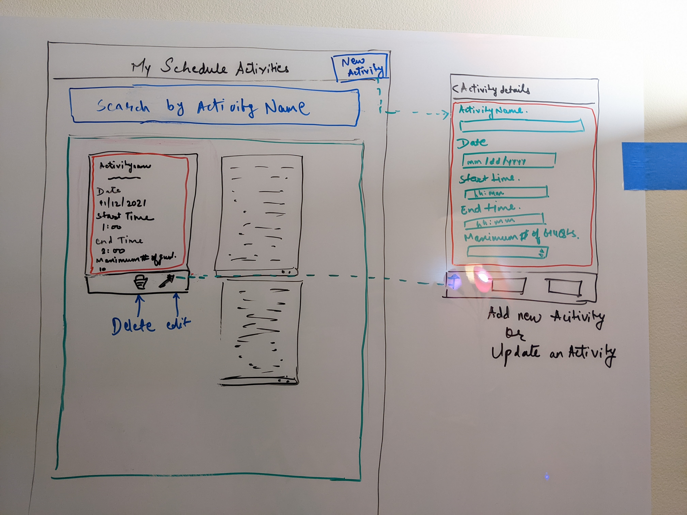
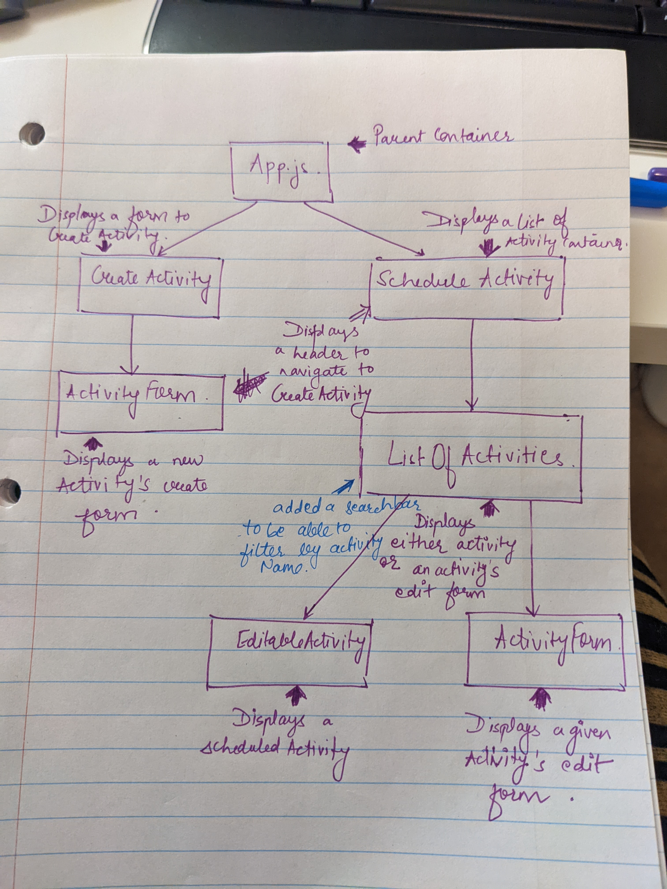

# Summary

Schedule Activity is an app where you can keep track of your timeslots. Add, edit or search timeslots.

## Folder Structure
```bash
├── README.md - This file.
├── package.json # npm package manager file.
├── public
│   ├── favicon.ico # React Icon
│   └── index.html
└── src
    ├── App.css 
        # Custom Styles for the app.
    ├── App.js 
        # This is the root of the app.
    ├── ScheduleActivity.js 
        # Used for rendering header, New Activity button and ListOfActivities Component.
    ├── ListOfActivities.js 
        # This component displays the Search bar and the list of activities in sorted order.
        # It renders EditableActivity Component and the ActivityForm component when an activity is edited.
    ├── CreateActivity.js 
        # Used for creating new scheduled activity.
    ├── EditableActivity.js 
        # Used for displaying each scheduled activity.
    ├── ActivityForm.js 
        # Used for displaying the editable form that appears after clicking the New Activity button or the pen icon on the already scheduled activity in the ListOfActivities.
    ├── icons 
        # Helpful images for your app.
    │   ├── arrow-back.svg
    │   ├── pen-to-square-solid.svg
    │   ├── trash-can-solid.svg
    │   ├── user-group-solid.svg
    ├── __tests__ 
        # Used for testing.
        ├── App.test.js 
            # Used for testing Snapshot of <App />.
        ├── ActivityForm.test.js 
            # Used for testing instance of <ActivityForm />.
            To check if the data being passed to activityName is valid.
        ├── ListOfActivities.test.js 
            # Used for testing props of <ListOfActivities />.
    ├── index.css 
        # Global styles.
    └── index.js 
        # It is used for DOM rendering only.
```

## Interface and Flow of the App

### Outline of App

The below image is showing the rough outline of how the app should look like.



The below image is showing the hierarchical tree of the components



# Getting Started with the App

This project is hosted at Netlify [Snehal's Schedule Activity](https://snehal-schedule-activity.netlify.app/).

## Available Scripts

To run the test cases, clone this project and follow the below steps.

### `npm test`

Run this command on the Node.js terminal.

## Future Enhancements

1. Add database to store the timeslots.
2. Include a login functionality to make the timeslots specific to a user.
3. Capability to be able to filter by date, time and the maximm number of guests.


